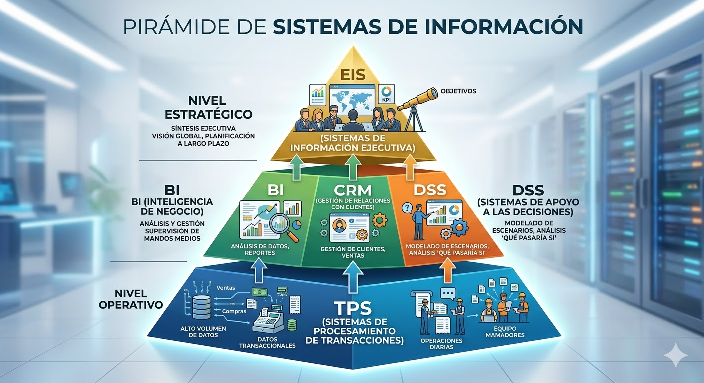
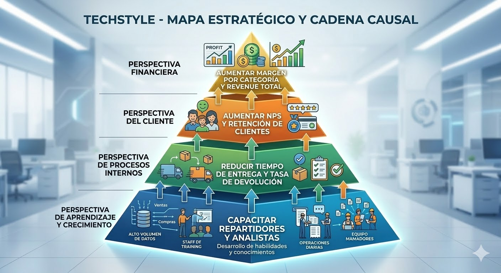

## ¿Qué Vimos la Semana Pasada?

::: {.incremental}
- Los **datos** por sí solos no son útiles → jerarquía dato–información–conocimiento–decisión.
- Un SI tiene **5 componentes**: hardware, software, datos, personas, procesos.
- TechStyle tiene **3 niveles organizacionales**: Sofía (operativo), Juan (táctico), Roberto (estratégico).
:::

::: {.fragment}
**Hoy**: ¿Qué tipo de SI sirve a cada nivel? ¿Y cómo alinea la organización sus sistemas hacia la estrategia?
:::

---

## Tipos de Sistemas de Información

| Sistema | Sigla | Nivel | Propósito |
|---|---|---|---|
| Transaction Processing System | **TPS** | Operativo | Registrar operaciones diarias |
| Business Intelligence | **BI** | Táctico | Analizar datos históricos |
| Decision Support System | **DSS** | Táctico/Estratégico | Apoyar decisiones no estructuradas |
| Customer Relationship Mgmt | **CRM** | Táctico | Gestionar relación con clientes |
| Executive Information System | **EIS** | Estratégico | Visión global del negocio |

---

## ERP: El Sistema que Integra Todo

**¿Qué pasa cuando todos los SI deben hablar entre sí?**

::: {.incremental}
- Un **ERP** (Enterprise Resource Planning) unifica TPS, CRM, logística y finanzas en una sola plataforma.
- En lugar de 5 sistemas desconectados, el ERP tiene **módulos integrados**: ventas, inventario, RRHH, contabilidad.
- Ejemplos: **SAP**, Oracle ERP, Microsoft Dynamics.
- TechStyle podría usar el módulo de ventas para el TPS y el módulo de clientes para el CRM, todos compartiendo la **misma base de datos**.
:::

::: {.fragment}
**Ventaja clave**: un pedido registrado en ventas actualiza automáticamente el inventario y las cuentas por cobrar.
:::

---

## DSS en Acción: Simulación de Escenarios

**¿Cómo apoya el DSS decisiones complejas?**

::: {.incremental}
- Roberto debe decidir si abrir 2 nuevos centros de distribución en el norte del país.
- El **DSS** le permite simular escenarios con datos históricos:
  - Escenario A: apertura en La Serena → reducción de 18h en tiempo de entrega, aumento de 12% en ventas proyectadas.
  - Escenario B: apertura en Antofagasta → reducción de 24h, aumento de 8% en ventas proyectadas.
- A diferencia del BI (que analiza el pasado), el DSS **proyecta hacia el futuro** usando modelos de datos.
:::

::: {.fragment}
**El DSS no decide: apoya la decisión.** Roberto elige, pero con información cuantificada.
:::

---

## TPS vs BI: Las Dos Caras del Dato

| Característica | TPS | BI |
|---|---|---|
| **Tiempo** | Tiempo real | Histórico (días, meses, años) |
| **Operación** | Lectura/escritura constante | Solo lectura (consultas) |
| **Volumen por consulta** | Pocas filas (1 pedido) | Millones de filas (todos los pedidos) |
| **Usuario** | Sofía (operativo) | Juan (táctico) |
| **Pregunta tipo** | "¿Se registró el pedido #4821?" | "¿Cuánto vendimos en el Q3 por región?" |
| **Base de datos** | BD transaccional | Data Warehouse |

::: {.fragment}
**No son competidores**: el TPS genera los datos que el BI analiza. Son parte de la misma cadena.
:::

---

## La Pirámide de los Tipos de SI

::: {.fragment}
*El TPS genera los datos crudos. El BI los transforma en información. El EIS presenta los KPIs estratégicos. La cadena es completa solo si cada eslabón funciona.*
:::

---

## Aplicación: Flujo de Datos entre Tipos de SI en TechStyle

**¿Cómo se conectan los tipos de SI en la práctica?**

::: {.incremental}
- **TPS** (operativo): registra cada pedido, pago, entrega → genera millones de transacciones
- **ETL** (noche): extrae y limpia los datos del TPS → carga al Data Warehouse
- **BI** (táctico): Juan consulta el DW → genera reportes de ventas por zona y categoría
- **CRM** (táctico): María ve el historial de cada cliente → segmenta la campaña
- **EIS** (estratégico): Roberto ve en su dashboard los 5 KPIs clave del mes
:::

::: {.fragment}
**El fallo en el TPS se propaga hacia arriba**: datos incorrectos en la base → KPIs incorrectos en el EIS.
:::

---

## Tipos de SI en TechStyle

::: {.incremental}
- **Sofía** usa un **TPS**: registra cada entrega con el estado del pedido en tiempo real.
- **Juan** usa **BI**: genera dashboards semanales de ventas por categoría y zona.
- **María** usa un **CRM**: ve el historial de compras de cada cliente para segmentar la campaña.
- **Roberto** usa un **EIS**: ve en una pantalla la situación global de TechStyle (ventas, NPS, rentabilidad).
:::

::: {.fragment}
**Pregunta**: ¿Podrían Sofía y Roberto usar el mismo sistema? ¿Por qué no?
:::

---

## Ecosistema Digital: TechStyle Integrado

**Todos los sistemas comparten datos, pero cada uno tiene su rol:**

::: {.incremental}
- **Capa operativa**: TPS registra transacciones → datos crudos en BD transaccional.
- **Capa de integración**: ETL extrae, transforma y carga datos al **Data Warehouse** cada noche.
- **Capa analítica**: BI y DSS consultan el DW → reportes y simulaciones.
- **Capa de relación**: CRM accede a datos del cliente desde el DW y el TPS.
- **Capa estratégica**: EIS consume KPIs precalculados del DW → dashboard para Roberto.
:::

::: {.fragment}
**Problema de integración**: si cada sistema usa un formato diferente para "región", los reportes generan duplicados. → esto es un problema de **calidad de datos** (lo veremos en breve).
:::

---

## Verificación: ¿Qué SI Necesita Cada Situación?

**Clasifica qué tipo de SI sería el más adecuado:**

::: {.incremental}
1. Un banco que necesita registrar cada transacción de cajero automático en tiempo real → **TPS**
2. El gerente de una cadena de supermercados quiere ver la participación de mercado en una pantalla → **EIS**
3. Un equipo de ventas necesita ver el historial de contacto con cada cliente potencial → **CRM**
4. Un analista quiere comparar las ventas de los últimos 24 meses por región y temporada → **BI**
5. La dirección debe decidir si abrir una nueva sucursal usando datos de demanda proyectada → **DSS**
:::

---

## El Cuadro de Mando Integral (CMI)

**¿Cómo alinea una organización todos sus SI hacia la estrategia?**

El **CMI** (Balanced Scorecard) traduce la estrategia en **4 perspectivas** con KPIs medibles:

| Perspectiva | Pregunta clave |
|---|---|
| **Financiera** | ¿Estamos generando valor para los accionistas? |
| **Cliente** | ¿Estamos satisfaciendo a nuestros clientes? |
| **Procesos Internos** | ¿Nuestros procesos son eficientes? |
| **Aprendizaje y Crecimiento** | ¿Estamos mejorando como organización? |

---

## Historia del CMI: Kaplan y Norton (1992)

**¿Por qué fue revolucionario?**

::: {.incremental}
- Antes de 1992, las empresas medían su desempeño **solo financieramente** (ganancias, retorno).
- Robert Kaplan y David Norton (Harvard) publicaron que el desempeño financiero es una consecuencia, no una causa.
- La causa está en los **procesos**, los **clientes** y el **aprendizaje organizacional**.
- El CMI fue adoptado por el 70% de las empresas Fortune 500 en los años 2000.
:::

::: {.fragment}
**Para TechStyle**: si Roberto solo mira ventas totales, no sabe *por qué* caen ni *cómo* recuperarlas.
:::

---

## Mapa Estratégico de TechStyle

::: {.fragment}
*El mapa estratégico muestra que la rentabilidad de TechStyle depende de la satisfacción del cliente, que depende de los procesos, que dependen de las capacidades del equipo.*
:::

---

## Perspectiva Financiera: ¿Cuánto Generamos?

**Responde la pregunta**: ¿Estamos creando valor económico sostenible?

::: {.incremental}
- Mide los **resultados finales** de la estrategia en términos monetarios.
- KPIs típicos: ingresos totales, margen bruto, retorno sobre activos (ROA), crecimiento de ventas.
- **En TechStyle**: Roberto quiere saber si la expansión al norte fue rentable → KPI: "margen neto por zona geográfica".
- **Limitación**: los KPIs financieros son **lagging indicators** (indicadores rezagados): miden lo que ya ocurrió, no lo que está por ocurrir.
:::

::: {.fragment}
Por eso el CMI agrega las otras 3 perspectivas: para anticipar el resultado financiero futuro.
:::

---

## Perspectiva Cliente: ¿Nos Prefieren?

**Responde la pregunta**: ¿Estamos satisfaciendo a quienes nos compran?

::: {.incremental}
- Mide la percepción y comportamiento del cliente hacia la empresa.
- KPIs típicos: NPS, tasa de retención, tasa de devoluciones, tiempo de respuesta a reclamos.
- **En TechStyle**: María quiere saber si los clientes del norte vuelven a comprar → KPI: "tasa de recompra por zona en 90 días".
- **Conexión con financiera**: clientes satisfechos recompran → más ingresos → mejora la perspectiva financiera.
:::

::: {.fragment}
**Dato del sector**: aumentar la retención de clientes en un 5% puede incrementar las ganancias entre 25% y 95% (Bain & Company).
:::

---

## Perspectiva Procesos Internos: ¿Somos Eficientes?

**Responde la pregunta**: ¿Nuestros procesos operativos crean valor para el cliente?

::: {.incremental}
- Mide la eficiencia y calidad de los procesos que impactan directamente al cliente.
- KPIs típicos: tiempo de ciclo de pedido, tasa de error en picking, % de entregas en tiempo.
- **En TechStyle**: Sofía sabe que el proceso de despacho en zona sur tiene un cuello de botella → KPI: "tiempo promedio entre confirmación y despacho por bodega".
- **Conexión con cliente**: procesos eficientes → entregas a tiempo → clientes satisfechos.
:::

::: {.fragment}
Este es el nivel donde **la calidad de los datos del TPS** tiene mayor impacto. Un campo mal registrado distorsiona el KPI.
:::

---

## Perspectiva Aprendizaje y Crecimiento: ¿Evolucionamos?

**Responde la pregunta**: ¿Tenemos las capacidades para mejorar continuamente?

::: {.incremental}
- Mide el desarrollo del capital humano, tecnológico y organizacional.
- KPIs típicos: % empleados con capacitación certificada, índice de satisfacción del equipo, adopción de nuevas tecnologías.
- **En TechStyle**: el equipo de repartidores no sabe usar la nueva app de tracking → KPI: "% repartidores certificados en la app logística".
- **Conexión con procesos**: personas capacitadas → mejores procesos → clientes satisfechos → resultados financieros.
:::

::: {.fragment}
**Esta perspectiva es la base de la pirámide**: sin aprendizaje, los procesos no mejoran y la estrategia se estanca.
:::

---

## CMI de TechStyle: KPIs por Perspectiva

| Perspectiva | KPI | Fuente de datos |
|---|---|---|
| Financiera | Margen de contribución por categoría | TPS + BI |
| Cliente | NPS (Net Promoter Score) | CRM |
| Procesos | Tiempo promedio de entrega por zona | TPS |
| Aprendizaje | % reclamos resueltos en primera instancia | CRM + DSS |

::: {.fragment}
**Conexión clave**: Los KPIs del CMI dependen de que los datos del TPS sean correctos.
:::

---

## ¿Cómo Definir un Buen KPI? Criterios SMART

**Un KPI mal definido produce conclusiones erróneas aunque los datos sean perfectos.**

::: {.incremental}
- **S**pecific (Específico): "tiempo de entrega" es vago → "tiempo promedio entre confirmación y firma del cliente, en días hábiles" es específico.
- **M**easurable (Medible): debe poder calcularse desde datos reales del TPS o CRM.
- **A**chievable (Alcanzable): una meta de 0% devoluciones no es alcanzable; 3% sí lo es.
- **R**elevant (Relevante): debe conectarse a una decisión real que alguien tomará.
- **T**ime-bound (Acotado en tiempo): "ventas del Q3 2026", no solo "ventas".
:::

::: {.fragment}
**Ejercicio rápido**: ¿Es SMART el KPI "mejorar la satisfacción del cliente"? ¿Cómo lo mejorarían?
:::

---

## Verificación: ¿A Qué Perspectiva del CMI Pertenece Cada KPI?

**Clasifica cada indicador en su perspectiva:**

::: {.incremental}
1. "Tasa de devolución por zona geográfica" → **Procesos Internos**
2. "Crecimiento de ventas año a año" → **Financiera**
3. "% de empleados con certificación en logística" → **Aprendizaje y Crecimiento**
4. "NPS promedio de clientes nuevos" → **Cliente**
5. "Costo de adquisición de cliente (CAC)" → **Financiera** / **Cliente**
:::

---

## El Problema: Bonos Pagados con Datos Incorrectos

**Caso real en TechStyle**:

Roberto aprobó bonos para el equipo de ventas basados en el KPI "tiempo de entrega promedio = 2,1 días".

::: {.incremental}
- Al auditar, descubrieron que el TPS registraba "fecha de entrega" cuando el repartidor marcaba "en camino", no cuando el cliente firmaba la recepción.
- El tiempo real era 3,4 días.
- Los bonos se pagaron por rendimiento **ficticio**.
:::

---

## Análisis: ¿Dónde Falló la Calidad?

**Trazando el fallo hacia su origen:**

::: {.incremental}
- **Problema raíz**: la definición del campo `fecha_entrega` era ambigua en el proceso.
- **Falla en el TPS**: el software permitía marcar "entregado" sin validar la firma del cliente.
- **Falla en BI**: nadie auditó la consistencia del dato antes de usarlo en el KPI.
- **Impacto en el CMI**: el KPI de "procesos internos" era 60% más optimista que la realidad.
- **Impacto financiero**: $2,3M en bonos pagados por desempeño que no ocurrió.
:::

::: {.fragment}
**Este caso ejemplifica las 4 dimensiones de calidad de datos.**
:::

---

## Calidad de Datos: Las 4 Dimensiones

| Dimensión | Pregunta | Problema TechStyle |
|---|---|---|
| **Exactitud** | ¿El dato refleja la realidad? | Fecha de entrega ≠ fecha real |
| **Completitud** | ¿Hay campos vacíos? | 12% de clientes sin región |
| **Consistencia** | ¿El mismo dato dice lo mismo? | "Santiago" vs "Stgo." vs "RM" |
| **Oportunidad** | ¿Está disponible cuando se necesita? | Reporte de ventas disponible 3 días después |

---

## Más Allá de las 4 Dimensiones: Unicidad y Validez

**La calidad de datos tiene más facetas:**

::: {.incremental}
- **Unicidad**: ¿Existe el dato más de una vez sin deber existir?
  - TechStyle tiene el cliente "Ana González" duplicada con dos `cliente_id` distintos → el CRM la contacta dos veces → mala experiencia.
- **Validez**: ¿El dato sigue las reglas de negocio definidas?
  - Un pedido con `cantidad = -3` pasa la validación técnica, pero viola la regla de negocio "cantidad debe ser ≥ 1".
  - Un `rut = 12345678-9` puede ser técnicamente válido pero no corresponder a ningún cliente real.
:::

::: {.fragment}
**Para recordar**: un dato puede ser técnicamente correcto (no vacío, bien formateado) y aun así ser incorrecto para el negocio.
:::

---

## Aplicación: Auditoría de Calidad en el Dataset de TechStyle

**Hallazgos reales en `techstyle_orders.csv`:**

::: {.incremental}
- **Exactitud**: 847 filas con `fecha_entrega` anterior a `fecha_pedido` → imposible, dato incorrecto.
- **Completitud**: columna `región` vacía en 53.400 filas (12%) → imposible hacer reportes regionales completos.
- **Consistencia**: "Santiago", "Stgo.", "RM", "Región Metropolitana" → 4 representaciones del mismo valor.
- **Oportunidad**: el reporte de ventas diarias se genera a las 03:00 → María lo recibe a las 10:00 → toma decisiones con datos de ayer.
:::

---

## Verificación: Identifica la Dimensión Vulnerada

**¿Qué dimensión de calidad está en riesgo?**

::: {.incremental}
1. La columna `email` tiene 3.200 registros con el valor "no_email@test.com" → **Exactitud**
2. El campo `teléfono` está vacío en el 40% de los registros → **Completitud**
3. El mismo cliente aparece como "Pedro Muñoz" en ventas y "P. Munoz" en el CRM → **Consistencia**
4. Los datos de devoluciones del fin de semana no se cargan al BI hasta el lunes a mediodía → **Oportunidad**
:::

---

## Impacto de la Mala Calidad de Datos en el CMI

::: {.incremental}
- **Exactitud**: KPI de tiempo de entrega incorrecto → bonos mal pagados.
- **Completitud**: 12% clientes sin región → campaña regional incompleta.
- **Consistencia**: "Santiago" vs "RM" → duplicación en reportes de ventas.
- **Oportunidad**: Reporte tardío → María toma decisiones con información de hace 3 días.
:::

---

## El Costo Real de la Mala Calidad de Datos

**No es un problema menor:**

::: {.incremental}
- **Gartner** estima que la mala calidad de datos cuesta a las organizaciones un promedio de **$12,9 millones al año**.
- En TechStyle: $2,3M en bonos mal pagados fue solo un incidente en un trimestre.
- Los costos son múltiples: tiempo de corrección, decisiones equivocadas, pérdida de confianza en los datos, riesgo legal.
- **El efecto invisible**: los analistas de TechStyle pasan el 40% de su tiempo limpiando datos en lugar de analizarlos.
:::

::: {.fragment}
**Inversión preventiva**: implementar controles de calidad desde el TPS es más barato que corregir los errores semanas después.
:::

---

## Gobierno de Datos: La Solución Organizacional

**¿Quién es responsable de la calidad de los datos?**

::: {.incremental}
- El **gobierno de datos** es el conjunto de políticas, procesos y roles que garantizan la calidad y el uso adecuado de los datos.
- **Data Owner**: el área de negocio responsable de un conjunto de datos (ej: logística es dueña de `fecha_entrega`).
- **Data Steward**: el responsable operativo de mantener la calidad (ej: Sofía valida los datos de entrega antes de cerrar el turno).
- **Catálogo de datos**: diccionario oficial que define qué significa cada campo, quién lo gestiona y cómo se mide su calidad.
:::

::: {.fragment}
**Regla de oro**: sin gobierno de datos, la calidad depende de la buena voluntad individual → no es escalable.
:::

---

## Ética en el Manejo de Datos

**Tres principios fundamentales**:

::: {.incremental}
- **Transparencia**: Los clientes de TechStyle saben qué datos se recopilan y por qué.
- **Proporcionalidad**: Solo se recopilan los datos necesarios para el servicio (no más).
- **Seguridad**: Los datos personales de los clientes están protegidos contra acceso no autorizado.
:::

::: {.fragment}
**Caso de discusión**: TechStyle quiere guardar el historial de ubicación GPS de cada cliente para "personalizar recomendaciones". ¿Es ético? ¿Es proporcional?
:::

---

## Marco Legal: Ley 19.628 de Protección de Datos en Chile

**Lo que TechStyle debe cumplir:**

::: {.incremental}
- Los datos personales de clientes solo pueden usarse para el **fin declarado al momento de la recopilación**.
- El cliente tiene derecho a **acceder, modificar y eliminar** sus datos.
- Datos sensibles (salud, situación financiera) requieren **consentimiento explícito**.
- Chile se encuentra en proceso de actualizar esta ley para alinearse con el GDPR europeo.
:::

::: {.fragment}
**Implicación para el analista**: antes de usar un campo de datos, preguntarse si el cliente consintió ese uso específico.
:::

---

## Dilema Ético: El Caso de Geolocalización

**TechStyle analiza implementar rastreo GPS continuo de clientes:**

::: {.incremental}
- **Argumento a favor**: conocer dónde está el cliente permite enviar notificaciones de "tu pedido está a 10 minutos" → mejor experiencia.
- **Argumento en contra**: recopilar ubicación continua excede el propósito declarado de la compra → viola proporcionalidad.
- **Riesgo legal**: si ese dato se filtra, TechStyle enfrenta multas y pérdida de confianza masiva.
- **Pregunta de diseño**: ¿Se puede lograr la misma experiencia rastreando la ubicación del repartidor en lugar de la del cliente?
:::

::: {.fragment}
**Principio de privacidad por diseño**: la solución menos invasiva que logra el mismo objetivo siempre es la preferida.
:::

---

## El Analista de Datos como Guardián de la Información

**El rol del analista va más allá de consultar tablas:**

::: {.incremental}
- **Antes de usar un dato**, preguntarse: ¿para qué fue recopilado? ¿quién autorizó este uso?
- **Antes de publicar un reporte**, preguntarse: ¿podría este análisis identificar a una persona específica aunque no muestre nombres?
- **Ante un hallazgo de calidad**, reportarlo al Data Owner aunque nadie lo pida.
- **Ante presión para mostrar "mejores números"**, negarse a alterar metodologías para producir resultados convenientes.
:::

::: {.fragment}
**Integridad analítica**: la credibilidad de un analista se construye en años y se destruye en minutos. Los datos no mienten, pero los analistas pueden elegir cómo presentarlos.
:::

---

## Actividad: Dashboard para Tres Usuarios

**Power BI – Tres vistas del mismo dataset**:

En parejas, construyen en Power BI Desktop tres vistas del `techstyle_orders.csv`:

::: {.incremental}
1. **Vista de Sofía** (operativa): Mis pedidos del día, estado, dirección.
2. **Vista de Juan** (táctica): Ventas semanales por categoría y zona, gráfico de barras.
3. **Vista de Roberto** (estratégica): KPIs financieros del mes (total ventas, ticket promedio, NPS).
:::

::: {.notes}
Este es el Lab 2. En clase solo presentar el concepto; el trabajo práctico es en laboratorio.
:::

---

## Discusión Grupal: Diagnóstico de TechStyle

**Aplicando todo lo visto hoy:**

En grupos de 3, respondan las siguientes preguntas sobre TechStyle:

::: {.incremental}
1. ¿Qué tipo de SI debería registrar automáticamente la firma digital del cliente al recibir el pedido?
2. Si el KPI "NPS = 72" proviene de encuestas solo enviadas a clientes con compras > $50.000, ¿qué dimensión de calidad está vulnerada?
3. TechStyle quiere lanzar campañas de remarketing usando datos de navegación web de los clientes. ¿Qué consideraciones éticas y legales deben revisarse?
4. Diseña un KPI SMART para la perspectiva "Procesos Internos" del CMI de TechStyle.
:::

---

## Objetivos de Aprendizaje – Semana 2

::: {.incremental}
- Clasificar los **tipos de SI** (TPS, BI, DSS, CRM, EIS) según nivel organizacional.
- Diseñar un **CMI** con KPIs para las 4 perspectivas.
- Evaluar la **calidad de datos** en sus 4 dimensiones.
- Identificar implicaciones **éticas** del manejo de datos en una organización.
:::

---

## Puntos Clave

::: {.incremental}
- Cada nivel organizacional tiene su **tipo de SI** adecuado: TPS para Sofía, BI/CRM para Juan y María, EIS para Roberto.
- El **CMI** conecta la estrategia con datos medibles a través de 4 perspectivas: Financiera, Cliente, Procesos, Aprendizaje.
- La **calidad de datos** (exactitud, completitud, consistencia, oportunidad) determina la confiabilidad del CMI.
- Un dato incorrecto en el TPS corrompe toda la cadena hasta la decisión estratégica de Roberto.
- La **ética en datos** no es opcional: la Ley 19.628 exige transparencia, proporcionalidad y seguridad.
:::

---

## Preview del Laboratorio W02

**Lab W02 — Parte A: Dashboards por Nivel Organizacional**

::: {.incremental}
- En Power BI, crear 3 vistas del dataset de TechStyle para Sofía, Juan y Roberto.
- Cada vista debe mostrar solo la información relevante para ese nivel.
:::

**Lab W02 — Parte B: Auditoría de Calidad y CMI**

::: {.incremental}
- En Power Query, identificar y cuantificar problemas de calidad en el dataset (nulos, inconsistencias, valores imposibles).
- Diseñar el CMI de TechStyle con 2 KPIs por perspectiva y sus fuentes de datos.
:::

---

## Reflexión Final

> "No basta con tener el SI correcto. Los datos que alimentan ese SI deben ser exactos, completos, consistentes y oportunos. De lo contrario, el CMI muestra una realidad que no existe."

::: {.fragment}
**Próxima semana (W03)**: ¿Qué pasa cuando los datos crecen tanto que los sistemas tradicionales no pueden manejarlos? → Big Data, OLTP, Data Warehouse y ETL.
:::
