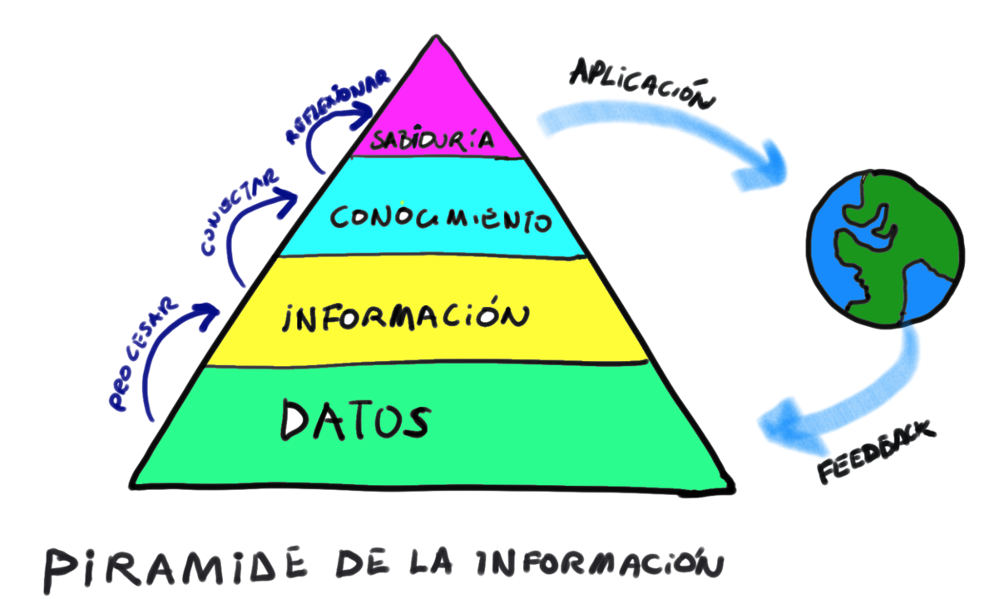
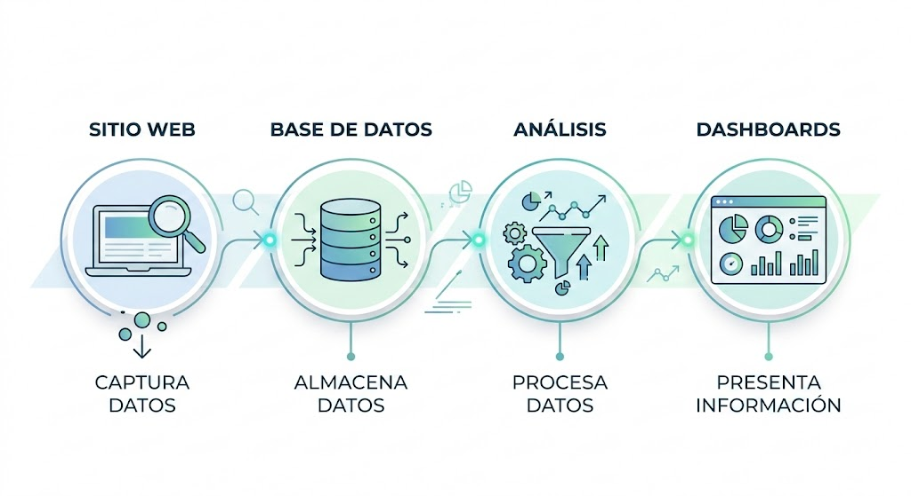

## Bienvenidos

**Big Data y Analytics**

Unidad 1: Sistemas de Información en el Contexto Empresarial

::: {.notes}
Dar la bienvenida a los estudiantes. Explicar que hoy tendrán una experiencia práctica antes de la teoría.
:::

---

## Situación Real: Lunes 9:00 AM

**Reunión de Gerencia - TechStyle**

María González, Gerente de Marketing de TechStyle (tienda online de retail), debe presentar su propuesta para la campaña del próximo mes.

**Presupuesto**: $15.000.000 CLP

**Pregunta**: ¿En qué categoría de productos invertir para maximizar las ventas?

::: {.notes}
Plantear el escenario como si los estudiantes estuvieran en esa sala. Hacer que se sientan parte de la situación.
:::

---

## TechStyle: La Empresa

- **Fundada**: 2018
- **Modelo**: E-commerce (ropa, accesorios, electrónica, hogar)
- **Clientes**: 450.000 usuarios registrados
- **Operación**: Nacional (Chile)
- **Desafío**: Crecimiento sostenible en mercado competitivo

::: {.fragment}
**¿Cómo debería María tomar esta decisión?**
:::

::: {.notes}
Preguntar a los estudiantes: ¿Ustedes qué harían? ¿Intuición? ¿Experiencia pasada?
:::

---

## El Activo de TechStyle: Sus Datos

María tiene acceso a las bases de datos de la empresa:

::: {.incremental}
- **Tabla `users`**: 450.000 registros
- **Tabla `orders`**: 2.340.000 registros
- **Tabla `order_items`**: 8.750.000 registros
- **Tabla `products`**: 12.500 registros
:::

::: {.fragment}
**Datos de 5 años de operación**
:::

::: {.notes}
Enfatizar el VOLUMEN. Esto es Big Data en contexto empresarial real.
:::

---

## Ejemplo: Tabla `order_items`

| order_id | product_id | quantity | unit_price | category     |
|----------|------------|----------|------------|--------------|
| 875432   | 4521       | 2        | 29.990     | Ropa         |
| 875432   | 8834       | 1        | 89.990     | Electrónica  |
| 875433   | 2341       | 3        | 15.990     | Hogar        |
| 875433   | 5512       | 1        | 125.000    | Electrónica  |
| 875434   | 7821       | 1        | 45.990     | Accesorios   |

**... y así 8.750.000 filas más**

::: {.notes}
Mostrar que son datos "crudos". No son útiles así tal cual.
:::

---

## El Equipo de Análisis Trabajó

María pidió al equipo técnico que procesara los datos.

**Pregunta realizada**:
*"¿Cuál categoría genera más ventas y tiene mejor margen?"*

::: {.fragment}
**El equipo analizó 5 años de datos en minutos**
:::

::: {.notes}
No explicar cómo. Solo enfatizar que procesaron millones de registros rápidamente.
:::

---

## Resultado del Análisis

| Categoría    | Ventas Totales (CLP) | Cantidad Órdenes | Margen Promedio | Tendencia |
|--------------|----------------------|------------------|-----------------|-----------|
| Electrónica  | 3.840.000.000        | 156.000          | 22%             | ↗ +15%    |
| Ropa         | 2.950.000.000        | 312.000          | 35%             | → 0%      |
| Hogar        | 1.870.000.000        | 98.000           | 28%             | ↗ +8%     |
| Accesorios   | 1.120.000.000        | 187.000          | 42%             | ↘ -5%     |

::: {.notes}
Dar tiempo para que lean la tabla. Preguntar qué observan.
:::

---

## Interpretación

::: {.incremental}
- **Electrónica**: mayor volumen, pero margen bajo (22%)
- **Ropa**: buen equilibrio, pero sin crecimiento
- **Hogar**: creciendo (+8%), margen aceptable (28%)
- **Accesorios**: mejor margen (42%), pero decreciendo (-5%)
:::

::: {.fragment}
**¿Qué decisión tomarían ustedes?**
:::

::: {.notes}
Abrir discusión. No hay respuesta única. Depende de la estrategia.
:::

---

## 💬 Discusión 1

**En grupos de 3-4 personas**:

1. ¿Qué observan en los resultados?
2. ¿En qué categoría invertirían? ¿Por qué?
3. ¿Qué información adicional necesitarían?

**Tiempo**: 5 minutos

::: {.notes}
Circular por la sala. Escuchar argumentos. Preparar para compartir.
:::

---

## Compartiendo Ideas

¿Qué decidió cada grupo?

::: {.fragment}
**Observación clave**:
Diferentes grupos pueden llegar a diferentes conclusiones con los mismos datos.
:::

::: {.fragment}
**Pero todos usaron EVIDENCIA para decidir**
:::

::: {.notes}
Validar todas las respuestas. Enfatizar que usaron datos, no solo intuición.
:::

---

## 💬 Discusión 2

**Pregunta crítica**:

¿María podría haber tomado esta decisión **sin** acceso a estos datos?

¿Qué hubiera pasado?

::: {.notes}
Llevar a los estudiantes a reconocer que sin datos, la decisión sería por intuición o experiencia pasada solamente.
:::

---

## Lo Que Acabamos de Ver

::: {.incremental}
✓ Una empresa real con millones de registros  
✓ Una pregunta de negocio concreta  
✓ Datos transformados en algo útil  
✓ Una decisión fundamentada
:::

::: {.fragment}
**Ahora entendamos QUÉ pasó aquí**
:::

::: {.notes}
Transición hacia los conceptos formales. "Vieron el pastel, ahora veamos los ingredientes".
:::

---

## Conceptos Fundamentales

**1. Dato**

Registro individual, sin contexto.

**Ejemplo**:
`29.990`
`Electrónica`
`2023-03-15`

::: {.fragment}
**Por sí solos, no dicen mucho**
:::

::: {.notes}
Enfatizar que los datos son "materia prima". No son útiles aislados.
:::

---

## Conceptos Fundamentales

**2. Información**

Datos **organizados y procesados** con significado.

**Ejemplo**:
"La categoría Electrónica generó $3.840 millones en ventas durante 2023"

::: {.fragment}
**Ahora tiene contexto y significado**
:::

::: {.notes}
La información surge cuando procesamos y organizamos datos.
:::

---

## Conceptos Fundamentales

**3. Conocimiento**

Información **interpretada** basada en experiencia y contexto.

**Ejemplo**:
"Electrónica tiene alto volumen pero bajo margen. Invertir allí requiere más presupuesto para obtener el mismo retorno que Hogar, que está creciendo."

::: {.fragment}
**Es información + análisis + experiencia**
:::

::: {.notes}
El conocimiento permite DECIDIR. Es el nivel más alto.
:::

---

## La Jerarquía del Valor

::: {.fragment}
**Cada nivel agrega valor al anterior**
:::

::: {.notes}
Este es el modelo fundamental del curso. Siempre volvemos a esto.
:::

---

## Conectando con TechStyle

**Datos**: Los 8.750.000 registros de `order_items`

**Información**: La tabla con ventas por categoría

**Conocimiento**: "Hogar está creciendo y tiene buen margen"

**Decisión**: Invertir $15M en campaña de categoría Hogar

::: {.notes}
Cerrar el círculo. Volver al caso inicial con los conceptos aprendidos.
:::

---

## 💬 Discusión 3

**En parejas**:

Identifiquen qué es DATO y qué es INFORMACIÓN en estos ejemplos:

1. "Cliente ID: 45821"
2. "El 65% de nuestros clientes son mujeres entre 25-34 años"
3. "Temperatura: 23°C"
4. "Las ventas aumentan 30% los días de lluvia"

**Tiempo**: 3 minutos

::: {.notes}
1 y 3 son datos. 2 y 4 son información (datos procesados con significado).
:::

---

## ¿Cómo Pasamos de Datos a Decisiones?

::: {.fragment}
**Necesitamos un Sistema de Información**
:::

::: {.incremental}
- Capturar datos
- Almacenar datos de forma estructurada
- Procesar datos
- Presentar información útil
- Apoyar decisiones
:::

::: {.notes}
Introducir el concepto de Sistema de Información como respuesta a una necesidad.
:::

---

## Sistemas de Información (SI)

**Definición**:

Conjunto de componentes interrelacionados que **capturan, almacenan, procesan y distribuyen** información para apoyar la toma de decisiones en una organización.

::: {.fragment}
**No son solo computadoras**
Incluyen: personas, procesos, datos, tecnología
:::

::: {.notes}
Enfatizar que SI es más amplio que solo software.
:::

---

## ¿Por Qué TechStyle Necesita un SI?

::: {.incremental}
- **Volumen**: 8.750.000 registros (imposible analizar manualmente)
- **Velocidad**: Decisión en minutos, no semanas
- **Precisión**: Cálculos exactos (no aproximaciones)
- **Disponibilidad**: Acceso cuando se necesita
- **Consistencia**: Misma información para toda la organización
:::

::: {.notes}
Conectar características de Big Data con necesidades de negocio.
:::

---

## El SI de TechStyle (Simplificado)

::: {.fragment}
**Cada venta, cada click, cada producto visto se registra automáticamente**
:::

::: {.notes}
Mostrar el flujo completo de manera simple y visual.
:::

---

## 💬 Discusión 4

**Pregunta para la clase**:

¿Qué otras decisiones importantes debe tomar TechStyle que requieren datos?

**Ejemplos de áreas**:
Inventario | Marketing | Finanzas | Logística | Recursos Humanos

::: {.notes}
Abrir discusión abierta. Mostrar que TODAS las áreas necesitan datos.
:::

---

## Ejemplos de Decisiones con Datos

::: {.incremental}
- **Inventario**: ¿Cuántas unidades comprar de cada producto?
- **Marketing**: ¿A qué clientes enviar promociones?
- **Finanzas**: ¿Es el negocio rentable por región?
- **Logística**: ¿Dónde ubicar un nuevo centro de distribución?
- **RR.HH.**: ¿Cuánto personal necesitamos en temporada alta?
:::

::: {.fragment}
**Todas requieren transformar datos en información**
:::

---

## Actividad Grupal

**Contexto**: TechStyle quiere mejorar su Sistema de Información.

**Tarea en grupos (4-5 personas)**:

Identifiquen **5 tipos de datos** que TechStyle **DEBE** registrar para tomar mejores decisiones de negocio.

Para cada dato, expliquen:  
- ¿Qué decisión apoya?  
- ¿Por qué es importante?  

 

**Tiempo**: 10 minutos  
**Entrega**: Presentación de 2 minutos por grupo

::: {.notes}
Circular, guiar. Ejemplo: "Hora exacta de cada compra" → decisión sobre horarios de envío.
:::

---

## Reflexión Final

**Pregunta de cierre**:

Antes de esta clase, ¿cómo creían que las empresas tomaban decisiones?

::: {.fragment}
**Ahora saben**:
Las organizaciones modernas basan sus decisiones en **datos estructurados** y procesados por **Sistemas de Información**.
:::

::: {.notes}
Cerrar con reflexión personal. Conectar con su experiencia previa.
:::

---

## Lo Que Aprendimos Hoy

::: {.incremental}
1. Las empresas generan **millones de datos** cada día
2. Los **datos** por sí solos no son útiles
3. Necesitamos transformar datos en **información**
4. Los **Sistemas de Información** hacen posible esa transformación
5. Las decisiones de negocio **deben** basarse en evidencia
:::

::: {.fragment}
**Vieron el pastel antes de conocer los ingredientes**
:::

---

## Próxima Clase

**Tema**: Componentes de un Sistema de Información

**Exploraremos**:

- Hardware, Software, Datos, Personas, Procesos
- Roles en un SI (usuarios, analistas, administradores)
- Cómo interactúan estos componentes

::: {.fragment}
**Preparen**: Piensen en sistemas que usan diariamente (redes sociales, banca, transporte)
:::

---

## Preguntas

¿Dudas o comentarios?

**Contacto**: francisco.zambrano@uss.cl

**Próxima clase**: Jueves 12 marzo a las 11:00

---

## ¡Gracias!

**Big Data y Analytics**
Universidad San Sebastián

::: {.notes}
Agradecer participación. Recordar actividad de próxima clase.
:::
