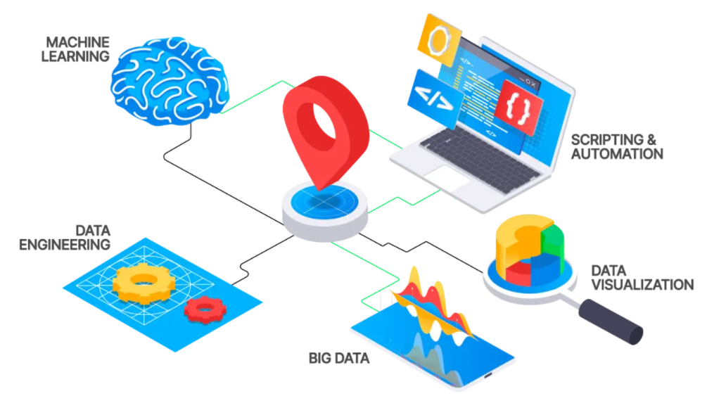

<!-- ══════════════════════════════════════════════════════════
     DIAPOSITIVA 1 — PORTADA / BIENVENIDA
     ══════════════════════════════════════════════════════════ -->

## Bienvenidos {.title-slide background-color="#1B3A6B"}

 

::: {style="color: #F7F4F0; text-align: center;"}

**Profesor Asociado · Investigador en Ciencia de Datos Espaciales**

Doctor en Ingeniería Agrícola (Recursos Hídricos)  
Ingeniero Civil Agrícola  
Universidad de Concepción

:::

 

::: {style="color: #C4956A; text-align: center; font-size: 0.9em;"}
*"Los datos son el lenguaje con el que la Tierra nos habla.
Aquí aprenderemos a escucharla."*
:::

::: {.notes}
**Apertura (1–2 min)**
Comenzar con energía y una sonrisa. Presentarse por nombre completo.
Decir algo como: *"No voy a empezar con un currículum. Voy a empezar con una pregunta: ¿cuántos de ustedes alguna vez han visto una noticia sobre sequías en Chile y se han preguntado cómo sabemos eso? Eso es exactamente lo que hacemos."*
Generar expectativa antes de entrar en los detalles del perfil.
:::

<!-- ══════════════════════════════════════════════════════════
     DIAPOSITIVA 2 — TRAYECTORIA ACADÉMICA
     ══════════════════════════════════════════════════════════ -->

## Mi Trayectoria Académica

::: {.timeline}

::: {.timeline-item}
[Ingeniería Civil Agrícola]{.timeline-year}
Base en recursos hídricos, riego y manejo del territorio.
La pregunta central desde el inicio: *¿Cómo gestionar el agua de manera sostenible?*
:::

::: {.timeline-item}
[Postgrado · Doctorado en Ingeniería Agrícola]{.timeline-year}
Especialización en **Recursos Hídricos**.
Investigación doctoral: análisis de la sequía agrícola en Chile continental.
:::

::: {.timeline-item}
[Profesor Asociado · Investigador]{.timeline-year}
Ciencia de Datos Espaciales aplicada al cambio climático y la aridificación.
Publicaciones en revistas de alto impacto · Proyectos con financiamiento de la Agencia Nacional de Investigacióin y Desarrollo de Chile (ANID).
:::

:::

::: {.caja-tierra}
El hilo conductor: **conectar datos del territorio con decisiones de política pública.**
:::

::: {.notes}
**Tono: Narrativo, no curricular (2 min)**
No leer el CV. Contar la historia como un viaje con una pregunta guía.
*"Estudié ingeniería agrícola porque crecí viendo cómo el agua —o su ausencia— define el destino de comunidades enteras en Chile. El doctorado fue la respuesta a una frustración: teníamos intuición, pero necesitábamos evidencia rigurosa."*
Destacar que la trayectoria siempre tuvo un propósito de impacto real, no solo académico.
:::

<!-- ══════════════════════════════════════════════════════════
     DIAPOSITIVA 3 — QUÉ ES LA CIENCIA DE DATOS ESPACIALES
     ══════════════════════════════════════════════════════════ -->

## ¿Qué es la Ciencia de Datos Espaciales?

::: {.cols-2}

::: {}
**La disciplina en una frase:**

> Extraer conocimiento significativo de datos que tienen una dimensión, **¿dónde?**, en el espacio y el tiempo.

**Tres pilares:**

- **Sistemas de Información Geográfica (SIG)**
  Representar el mundo como capas de datos
- **Estadística Espacial**
  Los vecinos importan: el espacio tiene autocorrelación
- **Ciencia de Datos**
  Modelamiento, aprendizaje automático, visualización
:::

::: {}

**Ejemplo concreto:**
*¿Dónde en Chile está cambiando la vegetación más rápido y por qué?*
:::

:::

::: {.notes}
**Hacer la disciplina tangible (2 min)**
Preguntar al curso: *"¿Alguno usa Google Maps? ¿Ha visto las capas de tráfico o calor? Eso es Ciencia de Datos Espaciales aplicada a la vida diaria."*
Luego escalar: *"Nosotros lo aplicamos a preguntas de mayor escala: cambio climático, biodiversidad, recursos naturales."*
Enfatizar que el espacio no es solo un contexto, es una variable que cambia los análisis.
:::

<!-- ══════════════════════════════════════════════════════════
     DIAPOSITIVA 4 — INVESTIGACIÓN: PROYECTO ODES
     ══════════════════════════════════════════════════════════ -->

## Investigación Destacada: Proyecto ODES

::: {.seccion-header}
**ODES — Observatorio de Sequía para la Agricultura y la Biodiversidad de Chile**
:::

**¿Qué buscamos?**

- Monitorear en tiempo real la dinámica de **sequías y desertificación** en Chile
- Integrar datos satelitales, climáticos e hidrológicos en una plataforma unificada
- Generar indicadores accionables para **gestores de recursos hídricos y políticas públicas**

**¿Por qué es urgente?**

> Chile es uno de los países con mayor variabilidad climática del mundo.
> La zona central lleva más de una década en **megasequía**.

::: {.caja-azul}
**Escala:** Nacional · **Resolución:** Subcuencas hidrográficas · **Frecuencia:** Mensual
:::

::: {.notes}
**Conectar el proyecto con la realidad del país (2–3 min)**
Mostrar entusiasmo genuino aquí — este es trabajo que importa.
*"Cuando hay sequía en La Araucanía o en el Maule, los agricultores necesitan respuestas en semanas, no en años. ODES existe para acortar ese ciclo entre dato y decisión."*
Si tienes una imagen del dashboard o del mapa de cobertura, este es el momento de mostrarla.
Mencionar cómo el proyecto conecta con el curso: *"Lo que ustedes van a aprender tiene aplicación directa en proyectos como este."*
:::

<!-- ══════════════════════════════════════════════════════════
     DIAPOSITIVA 5 — PUBLICACIONES RECIENTES
     ══════════════════════════════════════════════════════════ -->

## Investigación: Publicaciones Recientes

**Línea central de investigación:**

> *"Land-cover fingerprints of a drying Chile"*

::: {.cols-2}

::: {}
**¿Qué encontramos?**

- El cambio en la vegetación de Chile son **huellas** de la aridificación
- Distintos ecosistemas responden de manera diferente a la falta de agua
- Chile está pasando de una situación de sequía (eventual) a una de aridificación (permanente)

::: {.caja-tierra}
**Dato clave:** La zona mediterránea de Chile es uno de los 5 *hotspots* de biodiversidad más amenazados del planeta.
:::
:::

::: {}
**Otras líneas activas:**

- Índices de sequía multivariados 
- Cambios en la fenología vegetal bajo escenarios de cambio climático
- Integración de *machine learning* con datos de teledetección
- Estrés hídrico en huertos frutales

::: {style="font-size: 0.8em; color: #4A5568;"}
Publicaciones en: *Remote Sensing of Environment*, *Earth's Future*, *Agricultural Water Management*
:::
:::

:::

::: {.notes}
**Hacer la ciencia accesible (2 min)**
No entrar en detalles técnicos densos. La metáfora de las "huellas digitales" es poderosa.
*"Imagínense que el paisaje chileno es un paciente y los satélites son el equipo de diagnóstico. Las huellas de la aridificación son síntomas que aparecen en la vegetación antes de que el daño sea irreversible."*
Si el tiempo lo permite, mencionar una pregunta de investigación abierta en la que los estudiantes podrían contribuir.
:::

<!-- ══════════════════════════════════════════════════════════
     DIAPOSITIVA 6 — HERRAMIENTAS DEL OFICIO
     ══════════════════════════════════════════════════════════ -->

## Las Herramientas del Oficio

::: {.cols-2}

::: {}

R Python Google Earth Engine

**R — El lenguaje del análisis riguroso**

- Estadística espacial: `sf`, `terra`, `stars`
- Visualización: `ggplot2`, `tmap`
- Flujos de análisis reproducibles con `tidyverse`

**Python — Automatización y Machine Learning**

- Modelamiento predictivo: `scikit-learn`, `xarray`
- Procesamiento de grandes volúmenes de datos geoespaciales
- Orquestación de pipelines de datos

:::

::: {}

**Google Earth Engine — El telescopio de la Tierra**

- Acceso a décadas de imágenes satelitales (Landsat, Sentinel, MODIS)
- Cómputo en la nube a escala planetaria
- Sin necesidad de descargar terabytes de datos

::: {.caja-azul}
**La filosofía:**
La herramienta sirve a la pregunta,
no al revés.
Primero define *qué* necesitas saber,
luego elige *cómo* calcularlo.
:::

:::

:::

::: {.notes}
**Desmitificar las herramientas (2 min)**
Muchos estudiantes se sienten intimidados por el stack técnico.
*"Cuando yo empecé, R me parecía inaccesible. Hoy es como un idioma que pienso con fluidez. La clave no es memorizar funciones, es entender qué pregunta estás respondiendo."*
Mencionar que en el curso irán aprendiendo estas herramientas de forma progresiva, siempre con propósito.
Hacer la analogía: *"Un carpintero experto no elige el martillo antes de diseñar el mueble."*
:::

<!-- ══════════════════════════════════════════════════════════
     DIAPOSITIVA 7 — POR QUÉ IMPORTA ESTE TRABAJO
     ══════════════════════════════════════════════════════════ -->

## Por Qué Importa Este Trabajo

::: {.cols-2}

::: {}

**El contexto global:**

- El cambio climático ya no es una predicción — es una medición
- Chile experimenta una de las sequías más prolongadas de su historia
- Millones de personas y ecosistemas únicos en riesgo

 

**El impacto directo:**

- Decisiones de política hídrica basadas en evidencia
- Alertas tempranas para comunidades agrícolas vulnerables
- Conservación de biodiversidad endémica amenazada

:::

::: {}

::: {.caja-tierra}
**Zona de sacrificio o zona de oportunidad:**

La Ciencia de Datos Espaciales puede ser la diferencia entre reaccionar a una crisis y anticiparla.
:::

 

> "No analizamos el territorio por curiosidad académica.
> Lo hacemos porque hay decisiones reales
> que dependen de datos reales."

:::

:::

::: {.notes}
**El momento de más emoción en la presentación (2–3 min)**
Aquí debes hablar desde el corazón. ¿Por qué dedicas tu vida a esto?
*"Recuerdo hablar con agricultores en el Valle del Limarí que no sabían si plantar esa temporada porque el agua podría no llegar. Nuestros modelos no resuelven el problema del agua, pero pueden darles información a tiempo para tomar mejores decisiones."*
Conectar con el presente: *"La megasequía que vivimos no es solo una estadística — está transformando el paisaje de Chile de manera permanente. Entender eso es urgente."*
:::

<!-- ══════════════════════════════════════════════════════════
     DIAPOSITIVA 8 — MÁS ALLÁ DEL LABORATORIO
     ══════════════════════════════════════════════════════════ -->

## Más Allá del Laboratorio

::: {.cols-2}

::: {}

**El corredor de fondo:**

- Aficionado al running
- Primera **media maratón** (21 km)
- Filosofía del entrenamiento aplicada a la investigación:

::: {.caja-azul}
*El progreso no es lineal.*
*Los mejores resultados vienen
de la consistencia, no de los sprints.*
:::

**Lo que el running me enseñó:**
Tolerancia al proceso lento · Gestión de la frustración · Celebrar kilómetros, no solo metas

:::

::: {}

**Padre de dos:**

- La perspectiva más importante que tengo
- Me recuerda diariamente para qué hacemos ciencia

**Otras curiosidades:**

- Lector de literatura
- Aficionado del descenso, senderismo y vida en la naturaleza
- Creo firmemente en que la mejor ciencia es la que se puede explicar con claridad

::: {style="color: #C4956A; font-weight: 600;"}
Fuera del aula también soy persona — y eso importa.
:::

:::

:::

::: {.notes}
**Humanizar el vínculo con los estudiantes (1–2 min)**
Este slide existe para romper la distancia profesor–alumno.
*"Les cuento esto porque creo que los mejores ambientes de aprendizaje son los que tienen confianza. Y la confianza comienza cuando nos vemos como personas, no solo como roles."*
La analogía del running es genuinamente útil para hablar de los ritmos del aprendizaje: habrá semanas duras, habrá días de flujo, todo es parte del proceso.
Invitar a los estudiantes a compartir también algo de ellos mismos en la próxima sesión.
:::

<!-- ══════════════════════════════════════════════════════════
     DIAPOSITIVA 9 — EXPECTATIVAS Y MENTORÍA
     ══════════════════════════════════════════════════════════ -->

## Expectativas y Mentoría

::: {.cols-2}

::: {}

**Cómo trabajo con estudiantes:**

- **Puertas abiertas** — Las preguntas nunca son malas
- **Feedback directo** — Prefiero la claridad a la suavidad diplomática
- **Proceso sobre resultado** — Me interesa cómo piensan, no solo la respuesta final
- **Trabajo reproducible** — Todo código y análisis debe poder repetirse

**Lo que espero de ustedes:**

- Curiosidad genuina
- Tolerancia a la ambigüedad (los datos reales son complicados)
- Comunicación proactiva si algo no está claro

:::

::: {}

**Lo que pueden esperar de mí:**

- Clases preparadas con contexto real y aplicación práctica
- Retroalimentación oportuna y específica
- Conexión honesta entre teoría y práctica profesional

::: {.caja-tierra}
**Oportunidades disponibles:**

- Participación en proyectos de investigación activos
- Ayudantías de investigación
- Co-autoría en publicaciones para estudiantes destacados
:::

:::

:::

::: {.notes}
**Establecer el contrato pedagógico (2 min)**
Este slide define la cultura del curso. Ser directo y claro aquí previene malentendidos después.
*"Mi trabajo no es hacerles fácil lo difícil. Mi trabajo es acompañarlos a través de lo difícil para que al final tengan una habilidad real."*
Mencionar que están trabajando con datos del mundo real — eso significa que a veces el análisis no da el resultado esperado, y eso también es valioso.
Sobre las oportunidades de investigación: *"Si alguno tiene interés genuino en profundizar, venga a conversar. Siempre hay proyectos donde una mano adicional y curiosa es bienvenida."*
:::

<!-- ══════════════════════════════════════════════════════════
     DIAPOSITIVA 10 — PREGUNTAS Y CONTACTO
     ══════════════════════════════════════════════════════════ -->

## Preguntas · Conversación · Contacto {background-color="#1B3A6B"}

::: {style="color: #F7F4F0;"}

**¿Tienen preguntas?**

*Sobre el curso, la investigación, la carrera, el running... cualquier cosa.*

:::

 

::: {.cols-2}

::: {style="background: rgba(255,255,255,0.15); padding: 1em; border-radius: 8px; color: #F7F4F0; border: 1px solid rgba(255,255,255,0.3);"}

**Contacto:**

- **Email:** francisco.zambrano@uss.cl
- **Oficina:** El Condor 796 / Piso 4
- **Atención:** Viernes 8:30 – 16:00

:::

::: {style="background: rgba(196,149,106,0.35); padding: 1em; border-radius: 8px; color: #F7F4F0; border: 1px solid rgba(196,149,106,0.6);"}

**Recursos adicionales:**

- **GitHub:** [github.com/frzambra](https://www.github.com/frzambra)
- **Google Scholar:** [link](https://scholar.google.com/citations?user=mKQRdOEAAAAJ&hl=es)
- **Proyecto ODES:** [odes-chile.org](https://odes-chile.org)

:::

:::

::: {style="color: #C4956A; text-align: center; font-size: 1.1em;"}
*"Los grandes análisis comienzan con una buena pregunta.
Empecemos a hacer preguntas juntos."*
:::

::: {.notes}
**Cierre cálido y apertura al diálogo (2–3 min)**
No terminar con "¿Alguna pregunta?" de manera pasiva. Generar la conversación activamente.
Sugerencias de preguntas para romper el silencio inicial:
- *"¿Alguien sabe qué es la megasequía chilena?"*
- *"¿Cuántos han trabajado con datos geográficos antes?"*
- *"¿Qué esperan llevarse de este curso?"*

Si el tiempo lo permite, pedir a dos o tres estudiantes que se presenten brevemente.
Terminar con energía: *"Me alegra estar aquí. Vamos a hacer trabajo que vale la pena."*
:::
